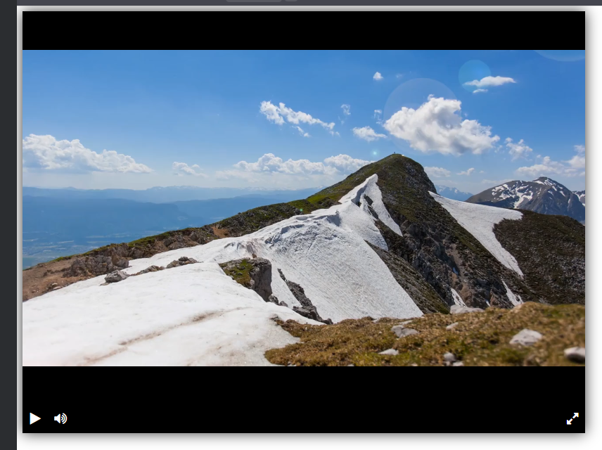

# Видеоплеер

**Демо:** https://equ17y.github.io/video-player-jslib/

## Функции
- Воспроизведение/пауза видео
- Громкость вкл/выкл
- Полноэкранный режим
- Тень вокруг плеера

## Установка
1. Клонировать репозиторий
2. Открыть `index.html` в браузере

## Скриншот
